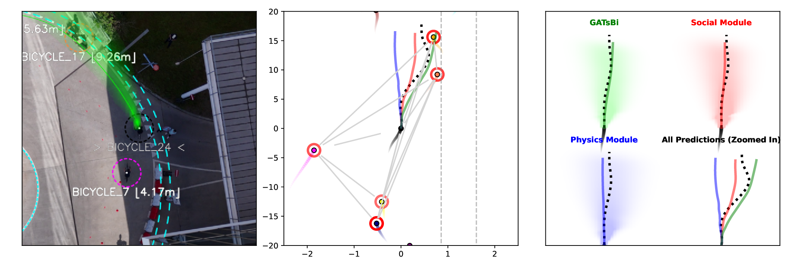
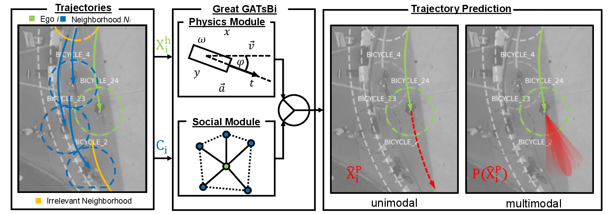
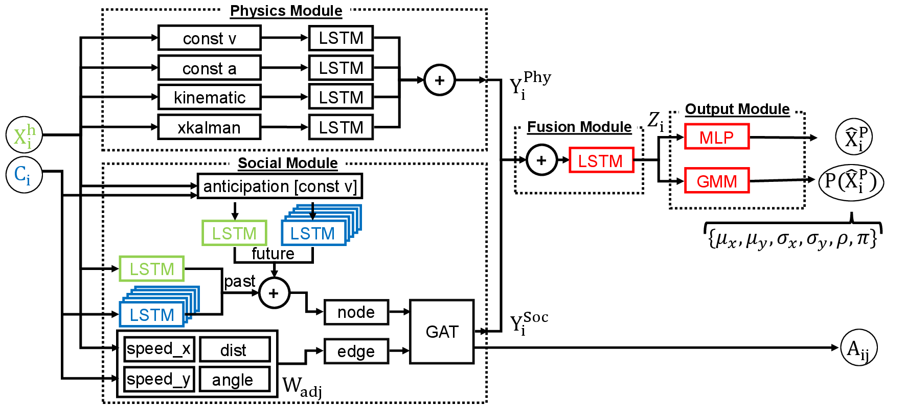

>📋  Based on template README.md for code accompanying a Machine Learning paper from [paperswithcode](https://github.com/paperswithcode/releasing-research-code/blob/master/templates/README.md) 

# Great GATsBi: Hybrid, Multimodal, Trajectory Forecasting for Bicycles using Anticipation Mechanism

==> FULL LENGTH PAPER HERE: https://arxiv.org/pdf/2508.14523

## Table of Contents
- [Introduction](#introduction)
- [Repository Structure](#repository-structure)
- [Dataset](#dataset)
- [Requirements](#requirements)
- [Training](#training)
- [Evaluation / Testing](#evaluation)
- [Pre-trained Models](#models)
- [Results](#results)
  - [Forecasting Benchmark on Mass Cycling Dataset](#results_1)
  - [Ablation Study](#results_2)
  - [Generalization Capability for Pedestrians (ETH+HOTEL Dataset)](#results_3)
  - [Codes to reproduce](#results_4)
- [License](#license)
- [Cluster and Runtime](#cluster)

## [Introduction](#introduction)

Accurate prediction of road user movement is increasingly required by many applications ranging from advanced driver assistance systems to autonomous driving, and especially crucial for road safety.
Even though most traffic accident fatalities account to bicycles, they have received little attention, as previous work focused mainly on pedestrians and motorized vehicles.
In this work, we present the *Great GATsBi*, a domain-knowledge-based, hybrid, multimodal trajectory prediction framework for bicycles.
The model incorporates both physics-based modeling (inspired by motorized vehicles) and social-based modeling (inspired by pedestrian movements) to explicitly account for the dual nature of bicycle movement.
The social interactions are modeled with a graph attention network, and include decayed historical, but also anticipated, future trajectory data of a bicycles neighborhood, following recent insights from psychological and social studies.
The results indicate that the proposed ensemble of physics models -- performing well in the short-term predictions -- and social models -- performing well in the long-term predictions -- exceeds state-of-the-art performance.
We also conducted a controlled mass-cycling experiment to demonstrate the framework's performance when forecasting bicycle trajectories and modeling social interactions with road users. 


<table>
<tr>
<td colspan="2">

</td>
</tr>
<tr>
<td>

</td>
<td>

</td>
</tr>
</table>


## [Repository Structure](#repository-structure)

```
./great_gatsbi/
├── data/
│   ├── 0_videos/
│   ├── 1_trajectories/
│   ├── 2_datasets/
│   ├── 3_logs/
│   ├── 4_models/
│   └── 5_inferences/
├── figures/
├── src/
│   ├── data/
│   ├── models/
│   ├── training/
│   ├── utils/
│   ├── data_generator.py
│   ├── log_parser*.py
│   ├── model_inference.py
│   ├── test_model.py
│   └── train_model.py
├── LICENSE
├── README.md
└── requirements.txt
```

There are mainly five runnable python scripts that take run arguments and can be used to reproduce the results of the publication, that can be found in the *src/* directory. 
These runnable scripts can be executed to (i) create feature data from the raw trajectory files, (ii) train models, (iii) test models, (iv) parse logs of the training process, and (v) to generate inference on new data.
Their usage will be outlined in the following.

## [Dataset](#dataset)

<table>
<tr>
<td>
Specifically for this project we conducted a <b>mass-cycling experiment</b> during a conference workshop at our university, and video-captured the experiment with a drone from above. 
We cooperated with a company that wanted to promote their rental bicycles, and they kindly provided us with <b>more than 25 bicycles</b>.
</td>
<td>

</td>
</tr>
</table>


<details>
We chose a specific location at our campus for the experiment, that offers a **circular track (ring road)**.
This has several advantages: 
(i) we can observe all bicycles at the same time using a drone, 
(ii) the bicycles have a homogeneous road, solely interactions between bicycles drive their behaviour (and following the right alignment principle), 
(iii) we could control the traffic density on the road by adding or removing bicycles and disrupting the traffic flow dynamics manually.

In total we recorded **9 video files**, that **cover 30 minutes** of recording, at a resolution of 3840x2160 pixels, and a framerate of 25 frames/second.
The videos were stored in MP4 format and are about 25.7 GB large.
Due to interruptions by trucks, cars, and drone landing for battery change, only some parts of the video are useful for the purpose of this investigation.
We therefore selected **20 sequences** from these videos, as outlined in the following table.

| sequence_nr | video_file                    | part    | from_frame | to_frame | num_frames | num_bicycles |
|-------------|-------------------------------|---------|------------|----------|------------|--------------|
| 1           | DJI_20240906103036_0003_D.MP4 | PART_1  | 300        | 1950     | 1650       | 6            |
| 2           | DJI_20240906103036_0003_D.MP4 | PART_2  | 2425       | 3450     | 1025       | 10           |
| 3           | DJI_20240906103036_0003_D.MP4 | PART_3  | 5200       | 5350     | 150        | 10           |
| 4           | DJI_20240906103036_0003_D.MP4 | PART_4  | 5625       | 6154     | 529        | 14           |
| 5           | DJI_20240906103442_0004_D.MP4 | PART_1  | 0          | 1375     | 1375       | 14           |
| 6           | DJI_20240906103442_0004_D.MP4 | PART_2  | 2850       | 4500     | 1650       | 19           |
| 7           | DJI_20240906103850_0005_D.MP4 | PART_1  | 325        | 2050     | 1725       | 22           |
| 8           | DJI_20240906105321_0009_D.MP4 | PART_1  | 150        | 350      | 200        | 13           |
| 9           | DJI_20240906105621_0010_D.MP4 | PART_1  | 350        | 925      | 575        | 6            |
| 10          | DJI_20240906105621_0010_D.MP4 | PART_2  | 1250       | 1900     | 650        | 9            |
| 11          | DJI_20240906105621_0010_D.MP4 | PART_3  | 2250       | 2875     | 625        | 12           |
| 12          | DJI_20240906105621_0010_D.MP4 | PART_4  | 3075       | 3250     | 175        | 16           |
| 13          | DJI_20240906105621_0010_D.MP4 | PART_5  | 3250       | 3700     | 450        | 17           |
| 14          | DJI_20240906105621_0010_D.MP4 | PART_6  | 5950       | 6138     | 188        | 17           |
| 15          | DJI_20240906110027_0011_D.MP4 | PART_1  | 0          | 1725     | 1725       | 17           |
| 16          | DJI_20240906110027_0011_D.MP4 | PART_2  | 2525       | 3300     | 775        | 17           |
| 17          | DJI_20240906110027_0011_D.MP4 | PART_3  | 3500       | 4375     | 875        | 17           |
| 18          | DJI_20240906110027_0011_D.MP4 | PART_4  | 4675       | 5500     | 825        | 17           |
| 19          | DJI_20240906110027_0011_D.MP4 | PART_5  | 5850       | 6122     | 272        | 17           |
| 20          | DJI_20240906110432_0012_D.MP4 | PART_1  | 0          | 625      | 625        | 17           |
| | | | | | |
| | | | | **total** | 16054 | 25 |

In the next step we used two different **computer vision approaches** and manual annotation to **detect bicycles on the aerial images**: (i) object detection with YOLO, (ii) an approach that compares two consecutive frames for differences to identify moving objects with OpenCV.
Also, we extracted a characteristic pattern (the inner circle) with known geometric properties (radius 5.0m) using **Hough transform** (OpenCV), in order to conduct a homography transformation from pixel to Cartesian coordinates.
Afterwards we used a computational pipeline to extract trajectories from these object detections.
The trajectories were filtered with a **Kalman-Filter** and checked for quality manually. 

The trajectories can be found in `\great_gatsbi\data\1_trajectories`.
The trajectories of each sequence (named `video_file`+`-`+`part`+`.txt`) are stored in a **csv format**, with following columns:

| column_name   | example value             |  unit |
|---------------|---------------------------|-------|
| Vehicle_ID    | BICYCLE_1                 |   -   |
| Frame_ID      | 300                       |   -   |
| Global_Time   | 12.0                      |   [s] |
| Cartesian_X   | 1.969604762847424         |   [m] |
| Cartesian_Y   | 14.569321533923302        |   [m] |
| Polar_X       | 4.846762832391482         | [rad] |
| Polar_Y       | 14.701852702318593        |   [m] |
| v_Length      | 1.8                       |   [m] |
| v_Width       | 0.64                      |   [m] |
| v_Vel         | 0.7664797280991118        | [m/s] |

Please note following assumpetions when creating this dataset:
- the length and width were fixed for every bicycle.
- the Cartesian coodinates are relative to the center of the circle of our road track 
- Polar_X represents the angle and Polar_Y the radius (distance to circle center)

The volunteering participants of this mass cycling experiment all were informed that they will be recorded and gave their written consent.

</details>

## [Requirements](#requirements)


### Python & Packages
The implementation is conducted in **Python** (version >3.7).
To install requirements, please use the package management system **pip** as follows:

```setup
pip install -r requirements.txt
```

### Computational Resources
The proposed network was implemented in Pytorch which allows for the use of CPU on your local machine, in case you don't have access to any GPUs.
In case GPUs are available, the implementation will automatically switch to use CUDA.
Within a reasonable amount of time (within multiple minutes per epoch), training and testing can be conducted even without GPUs.

### Preparation of Trajectory Dataset
Please extract all trajectory txt files from `\great_gatsbi\data\1_trajectories\1_trajectories.zip` and store them in the folder `\great_gatsbi\data\1_trajectories`.

On Linux you could use this command:
```
unzip great_gatsbi/data/1_trajectories/1_trajectories.zip -d great_gatsbi/data/1_trajectories/
```

## [Training](#training)

### Data Generation
We recommend to **precalculate all training & testing data from the trajectory data**, as this is time consuming (especially physical and social features) this might take up to 20 hours.
We recommend reviewers to run it for one video only with few frames (e.g. *PART_3* of *DJI_20240906103036_0003_D.MP4*).
First, training data needs to be generated with the script `data_generator.py`. 
The results are stored in `\great_gatsbi\data\2_datasets`.

The script can be used as follows:
```
python data_generator.py
```

Three different types of features are generated:
- **Physical Features**
    - preditions according to constant velocity model
    - predictions according to constant acceleration model
    - predictions according to bicycle kinematics model
    - predictions according to an extended Kalman filter
- **Social Features**
    - ego's historical trajectory
    - ego's future trajectory (for testing only)
    - neighbor's historical trajectory
    - adjacency matrix representing ego and neighbor's graph incl. distance, angle, rel. speed x and y
    - neighbors include ego's five closest neighbors (within a max. distance of 20m)

### Model Training

To train the model you can use  the script `train_model.py`. 
The resulting models are stored in `\great_gatsbi\data\4_models`.

The script can be used as follows:
```
python train_model.py [1] [2] [3] [4] ([5])
    [1] - model ("social_lstm" or "social_bigat" or "gatsbi")
    [2] - prediction_length in [s] (25, 50, 75, 100)
    [3] - max_epochs
    [4] - split ("split_1" or "split_2" or "split_3" or "split_4" or "split_5")
    optional:
    [5] - multimodal ("unimodal" or "multimodal_gmm" or "multimodal_cvae")
```

An example to train a model can be found here:
```
python train_model.py social_lstm 25 10 split_1 unimodal
```

After training of each epoch a model file is stored in the models folder, as well as a txt file containing the performance on the test set.


## [Evaluation / Testing](#evaluation)

To test the model (and thus evaluate) you can use the script `test_model.py`. 
The resulting evaluation metrics are printed to the console.

The script can be used as follows:
```
python test_model.py [1] [2] [3] [4] ([5])
    [1] - model ("social_lstm" or "social_bigat" or "gatsbi" or "const_v" or "const_a" or "kinematics" or "xkalman")
    [2] - model_file_name
    [3] - prediction_length in [s] (25, 50, 75, 100)
    [4] - split ("split_1" or "split_2" or "split_3" or "split_4" or "split_5" or "all")
    optional:
    [5] - multimodal ("unimodal" or "multimodal_gmm" or "multimodal_cvae")
```

An example to run a test can be found here:
```
python test_model.py social_lstm social_lstm_25_5_0010.model 25 split_1 unimodal
```
This outputs something like this in the unimodal case:
```
{'ADE': 0.19542816281318665, 'FDE': 0.4298399090766907}
```
and something like this in the multimodal case (where numbers reflect (i) best mode, (ii) most probably mode, (iii) randomly sampled mode), (iv) expected mode):
```
{'ADE': [0.683112382888794, 0.9391429424285889, 3.8939247131347656, 0.8007057309150696], 'FDE': [1.7313454151153564, 2.219844341278076, 10.175103187561035, 2.3272922039031982]}
```

### Evaluation Metrics

We use average displacement error (ADE) and final displacement error (FDE) as evaluation metrics.
These evaluation metrics are common metrics in the domain of trajectory prediction.
For a given predicted trajectory $\hat{X}_{i,t_f}^{p}$, that is based on a certain number of historical observations $t_{obs}$ and a true future trajectory $X_{i,t_f}^{p}$ the prediction for a timehorizon $t_{pred}$ can be evaluated as follows:

$ADE = \frac{1}{t_{pred}} \sum_{t} \| \hat{X}_i^{p} - X_i^{p}\|_2$

$FDE = \| \hat{X}_{i,t_f}^{p} - X_{i,t_f}^{p}\|_2$ at time $t_f=t_{obs}+t_{pred}$


## [Pre-trained Models](#models)

[TODO]
You can download pretrained models here:

- [My awesome model](https://drive.google.com/mymodel.pth) trained on ImageNet using parameters x,y,z. 

>📋  Give a link to where/how the pretrained models can be downloaded and how they were trained (if applicable).  Alternatively you can have an additional column in your results table with a link to the models.

## [Results](#results)

### [Forecasting Benchmark on Mass Cycling Dataset](#results_1)

Table 1 compares *GATsBi* with physics-based baseline models (*const_v*, *const_a*, *kinematics*, and *xkalman*) and social, learning-based baseline models that capture social interactions from pedestrian prediction literature (*SocialLSTM* and *Social-BiGAT*). 
The comparison reveals insights across different prediction horizons for ADE and FDE evaluation metrics.

**Table 1: Forecasting Benchmark on Mass Cycling Dataset**
| Model  | ADE | ADE | ADE | ADE | FDE | FDE | FDE | FDE |
|------------|----|----|----|----|----|----|----|----|
| *prediction length*           | *1s* | *2s* | *3s* | *4s* | *1s* | *2s* | *3s* | *4s* |**Physics**             |                   |                   |                   |                   |                   |                   |                   |                   |
| const_v                 | 0.1080  <br> [0.0076] | 0.2818  <br> [0.0194] | 0.5460  <br> [0.0444] | 0.9406  <br> [0.1059] | 0.2592  <br> [0.0182] | 0.6568  <br> [0.0436] | 1.5245  <br> [0.1787] | 2.7275  <br> [0.4278] |
| const_a                 | 0.1281  <br> [0.0118] | 0.5504  <br> [0.0482] | 1.2951  <br> [0.1180] | 2.3929  <br> [0.2292] | 0.3934  <br> [0.0346] | 1.6373  <br> [0.1422] | 4.0117  <br> [0.3857] | 7.3837  <br> [0.7451] |
| kinematics              | 0.1103  <br> [0.0088] | 0.3942  <br> [0.0364] | 0.8914  <br> [0.0905] | 1.6309  <br> [0.1795] | 0.3027  <br> [0.0260] | 1.1047  <br> [0.1068] | 2.7238  <br> [0.3056] | 4.9800  <br> [0.5935] |
| xkalman                 | 0.1445  <br> [0.0122] | 0.3269  <br> [0.0242] | 0.5967  <br> [0.0512] | 0.9948  <br> [0.1146] | 0.3068  <br> [0.0235] | 0.7154  <br> [0.0492] | 1.5887  <br> [0.1904] | 2.7913  <br> [0.4417] |
| *physics_module         | 0.0802  <br> [0.0057] | 0.2263  <br> [0.0140] | 0.4513  <br> [0.0365] | 0.8045  <br> [0.0924] | 0.2110  <br> [0.0136] | 0.5335  <br> [0.0313] | 1.3292  <br> [0.1714] | 2.4936  <br> [0.3703] |
| **Social**              |                   |                   |                   |                   |                   |                   |                   |                   |
| SocialLSTM              | 0.0876  <br> [0.0071] | 0.2487  <br> [0.0133] | 0.4762  <br> [0.0359] | 0.8214  <br> [0.0911] | 0.2141  <br> [0.0162] | 0.5479  <br> [0.0332] | 1.2829  <br> [0.1674] | 2.3770  <br> [0.4008] |
| Social-BiGAT            | 0.0702  <br> [0.0068] | 0.2240  <br> [0.0139] | 0.4586  <br> [0.0377] | 0.8069  <br> [0.0898] | 0.1914  <br> [0.0138] | 0.5242  <br> [0.0304] | 1.3234  <br> [0.1302] | 2.5356  <br> [0.3435] |
| *social_module          | **0.0629**  <br> [0.0057] | 0.2101  <br> [0.0137] | 0.4284  <br> [0.0343] | 0.7834  <br> [0.0838] | **0.1749**  <br> [0.0838] | 0.4941  <br> [0.0309] | 1.2761  <br> [0.1376] | 2.4732  <br> [0.2935] |
| **Great GATsBi**        | 0.0715  <br> [0.0066] | **0.2078**  <br> [0.0130] | **0.4181**  <br> [0.0354] | **0.7543**  <br> [0.0960] | 0.1893  <br> [0.0153] | **0.4891**  <br> [0.0258] | **1.2641**  <br> [0.1762] | **2.3827**  <br> [0.4103] |

*Evaluation metrics (ADE and FDE) reported in average and standard deviation (in brackets) across all train/test splits for four different prediction horizons (1s to 4s). Bold numbers mark the best forecasting performance.*


### [Ablation Study](#results_2)

To better understand the contributions of the elements of the proposed \textit{GATsBi} and anticipation mechanism, several ablation studies were conducted, as shown in the following table.

**Table 2: Great GATsBi Ablations on Mass Cycling Dataset.**
| Model  | ADE | ADE | ADE | ADE | FDE | FDE | FDE | FDE |
|------------|----|----|----|----|----|----|----|----|
| *prediction length*           | *1s* | *2s* | *3s* | *4s* | *1s* | *2s* | *3s* | *4s* |
| unimodal            |  0.0757 | 0.2180 | 0.4302 | 0.7760 | 0.1948 | 0.5051 | 1.2286 | 2.3142 |
|             | [0.0059] | [0.0125] | [0.0343] | [0.0945] | [0.0138] | [0.0253] | [0.1554] | [0.4071] |
| no anticipation     | 0.0692 | 0.2099 | 0.4267 | 0.7735 | 0.1868 | 0.4924 | 1.2962 | 2.4673 |
|   | [0.0063] | [0.0121] | [0.0257] | [0.0795] | [0.0141] | [0.0248] |[0.1117] | [0.3420] |
| no decay            | 0.0707 | 0.2074 | 0.4204 | 0.7727 | 0.1893 | 0.4901 | 1.2824 | 2.5016 |
|     | [0.0063] | [0.0125] | [0.0338] | [0.0966] | [0.0130] | [0.0260] | [0.1488] | [0.4263] |
| star-connected      | 0.0690 | 0.2078 | 0.4347 | 0.7880 | 0.1873 | 0.5006 | 1.3159 | 2.5150 |
|   | [0.0086] | [0.0127] | [0.0368] | [0.0810] | [0.0175] | [0.0324] | [0.1234] | [0.2881] |
| **Great GATsBi**    | 0.0715 | 0.2078 | 0.4181 | 0.7543 | 0.1893 | 0.4891 | 1.2641 | 2.3827 |
|  | [0.0066] | [0.0130] | [0.0354] | [0.0960] | [0.0153] | [0.0258] | [0.1762] | [0.4103] |

*Evaluation metrics (ADE and FDE) reported in average and standard deviation (in brackets) across all train/test splits for four different prediction horizons (1s to 4s).*

### [Generalization Capability for Pedestrians (ETH+HOTEL Dataset)](#results_3)

Table 3 evaluates the pedestrian forecasting accuracy of the proposed *social_module* and the related anticipation mechanism.
Two common pedestrian datasets (*ETH* and *HOTEL*) serve for this purpose.

**Table 3: Forecasting Benchmark on Pedestrian Datasets.**
| Method                  | ADE (ETH) 0.8s | ADE (ETH) 1.6s | ADE (ETH) 2.4s | ADE (ETH) 4.0s | ADE (HOTEL) 0.8s | ADE (HOTEL) 1.6s | ADE (HOTEL) 2.4s | ADE (HOTEL) 4.0s |
|-------------------------|:--------------:|:--------------:|:--------------:|:--------------:|:----------------:|:----------------:|:----------------:|:----------------:|
| SocialLSTM              |    0.0150      |    0.0249      |    0.0372      |    0.0744      |     0.0375       |     0.0621       |     0.0901       |     0.1788       |
| Social-BiGAT            |    0.0541      |    0.0921      |    0.1384      |    0.2518      |     0.0437       |     0.0787       |     0.1083       |     0.2130       |
| *physics_module         |    0.0290      |    0.0386      |    0.0417      |    0.0814      |     0.0483       |     0.0760       |     0.1105       |     0.2150       |
| *social_module          |    0.0545      |    0.0970      |    0.1063      |    0.2319      |     0.0432       |     0.0763       |     0.1095       |     0.2117       |
| **Great GATsBi**        |    0.0420      |    0.0330      |    0.0479      |    0.0800      |     0.0459       |     0.0737       |     0.1135       |     0.2170       |


*Evaluation metric ADE reported for two benchmark datasets and for four forecasting horizons (0.8s to 4s).*

### [Codes to reproduce](#results_4)

#### 1) Create Log Files Of Classical Models
```
python test_model.py const_v x 25 all > ../data/3_logs/const_v_25.txt
python test_model.py const_a x 25 all > ../data/3_logs/const_a_25.txt
python test_model.py kinematics x 25 all > ../data/3_logs/kinematics_25.txt
python test_model.py xkalman x 25 all > ../data/3_logs/xkalman_25.txt
python test_model.py const_v x 50 all > ../data/3_logs/const_v_50.txt
python test_model.py const_a x 50 all > ../data/3_logs/const_a_50.txt
python test_model.py kinematics x 50 all > ../data/3_logs/kinematics_50.txt
python test_model.py xkalman x 50 all > ../data/3_logs/xkalman_50.txt
python test_model.py const_v x 75 all > ../data/3_logs/const_v_75.txt
python test_model.py const_a x 75 all > ../data/3_logs/const_a_75.txt
python test_model.py kinematics x 75 all > ../data/3_logs/kinematics_75.txt
python test_model.py xkalman x 75 all > ../data/3_logs/xkalman_75.txt
python test_model.py const_v x 100 all > ../data/3_logs/const_v_100.txt
python test_model.py const_a x 100 all > ../data/3_logs/const_a_100.txt
python test_model.py kinematics x 100 all > ../data/3_logs/kinematics_100.txt
python test_model.py xkalman x 100 all > ../data/3_logs/xkalman_100.txt
```

#### 2) Create Log Files Of Machine Learning Based Models (via Training)
[...]

#### 3) Script To Merge All Logs and Create Performance Table
```
python log_parser_classic.py const_v
python log_parser_classic.py const_a
python log_parser_classic.py kinematics
python log_parser_classic.py xkalman
python log_parser_ml.py social_lstm
python log_parser_ml.py social_bigats
python log_parser_ml.py physics_lstm
python log_parser_ml.py gatsbi
python log_parser_ml_multimodal_gmm.py social_lstm
python log_parser_ml_multimodal_gmm.py social_bigats
python log_parser_ml_multimodal_gmm.py physics_lstm
python log_parser_ml_multimodal_gmm.py gatsbi
```

Similarly, for pedestrian datasets (ETH+HOTEL) the files in *src/data_eth/* can be used.


## [License](#license)
This repository will be published on GitHub upon publication at ITSC 2026 under the MIT license.
For further details, please find the **LICENSE** file in this repository.


## [Cluster & Runtime](#cluster)

We used our university's computational facility that provided a Linux cluster (OS: Ubuntu 22.04.5 LTS, Kernel: Linux 5.15.0-134-generic) with the Slurm workload manager and GPUs (NVIDA RTX 4090). CUDA (3.11.6_cuda) and Python (v3.11.6) were installed.

In the following we outline several linux commands that we used to automate training and testing.

**[!!!] Important Note:** All of the following commands are executed from within folder `./great_gatsbi/src/`.

```
cd ./great_gatsbi/src/
```

### 1. Prepare Training Dataset
(takes time!)

### 2. Train Model
(takes around 3h)

For each model (social_lstm) and prediction_length (25, 50, 75, 100) we run ten epochs, that take around 2h.
We repeated the same 5 times, so the training was 5 times for 10 epochs each in the order the data appears in the script below.

```
./_submit_jobs.sh social_lstm 25 multimodal_gmm 10
```

```
#!/bin/bash

# Usage: ./_submit_jobs.sh <model_name> <prediction_length> <multimodal> <num_jobs_per_split>
if [ $# -ne 4 ]; then
    echo "Usage: $0 <model_name> <prediction_length> <multimodal> <num_jobs_per_split>"
    exit 1
fi

MODEL_NAME=$1
PRED_LEN=$2
MULTI_MODAL=$3
NUM_JOBS=$4

SPLITS=(split_1 split_2 split_3 split_4 split_5)

echo "The following job submission commands will be executed:"
for SPLIT in "${SPLITS[@]}"; do
    echo "Processing $SPLIT:"
    for i in $(seq 1 $NUM_JOBS); do
        if [ $i -eq 1 ]; then
            echo "  sbatch -n 4 -G 2 --time=02:30:00 --gres=gpumem:10g --mem-per-cpu=8000 --wrap=\"module load stack/2024-05 python/3.11.6_cuda ; python train_model.py $MODEL_NAME $PRED_LEN 50 $SPLIT $MULTI_MODAL\""
        else
            echo "  sbatch --dependency=afterany:<jobid_${SPLIT}_$((i-1))> -n 4 -G 2 --time=02:30:00 --gres=gpumem:10g --mem-per-cpu=8000 --wrap=\"module load stack/2024-05 python/3.11.6_cuda ; python train_model.py $MODEL_NAME $PRED_LEN 50 $SPLIT $MULTI_MODAL\""
        fi
    done
done

echo
read -p "Press Enter to confirm and submit the jobs..."

# Actual submission with dependency chaining per split
for SPLIT in "${SPLITS[@]}"; do
    PREV_JOBID=""
    echo "Submitting jobs for $SPLIT..."
    for i in $(seq 1 $NUM_JOBS); do
        if [ -z "$PREV_JOBID" ]; then
            JOBID=$(sbatch --parsable -n 4 -G 2 --time=02:30:00 --gres=gpumem:10g --mem-per-cpu=8000 \
                --wrap="module load stack/2024-05 python/3.11.6_cuda ; python train_model.py $MODEL_NAME $PRED_LEN 50 $SPLIT $MULTI_MODAL")
        else
            JOBID=$(sbatch --parsable --dependency=afterany:$PREV_JOBID -n 4 -G 2 --time=02:30:00 --gres=gpumem:10g --mem-per-cpu=8000 \
                --wrap="module load stack/2024-05 python/3.11.6_cuda ; python train_model.py $MODEL_NAME $PRED_LEN 50 $SPLIT $MULTI_MODAL")
        fi
        echo "  Submitted job $JOBID (iteration $i for $SPLIT)"
        PREV_JOBID=$JOBID
    done
done
```
